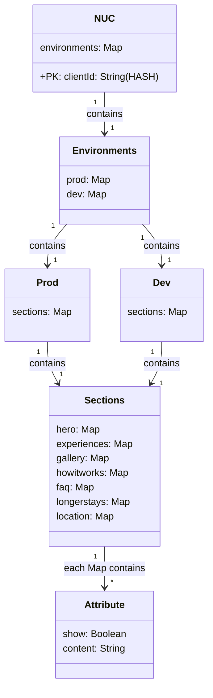

### DB diagram

```mermaid
classDiagram

class NUC {
    environments: Map
    +PK: clientId: String (HASH)
}

class Environments {
    prod: Map
    dev: Map
}

class Prod {
    sections: Map
}

class Dev {
    sections: Map
}

class Sections {
    hero: Map
    experiences: Map
    gallery: Map
    howitworks: Map
    faq: Map
    longerstays: Map
    location: Map
}

class Attribute {
    show: Boolean
    content: String
}

NUC "1" --> "1" Environments : contains
Environments "1" --> "1" Prod : contains
Environments "1" --> "1" Dev : contains
Prod "1" --> "1" Sections : contains
Dev "1" --> "1" Sections : contains
Sections "1" --> "*" Attribute : each Map contains
```