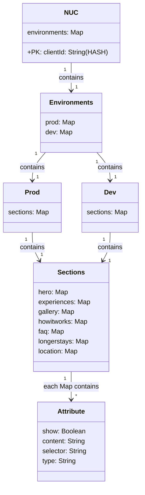

When you run the following `npm start` first time, you have to comment the following line `await dropTable();` from the file `main.js`. You can find it from the bottom part of the code.

### DB diagram
Here is highlevel diagram over the db structure. Sections is example of how the mapping works.
